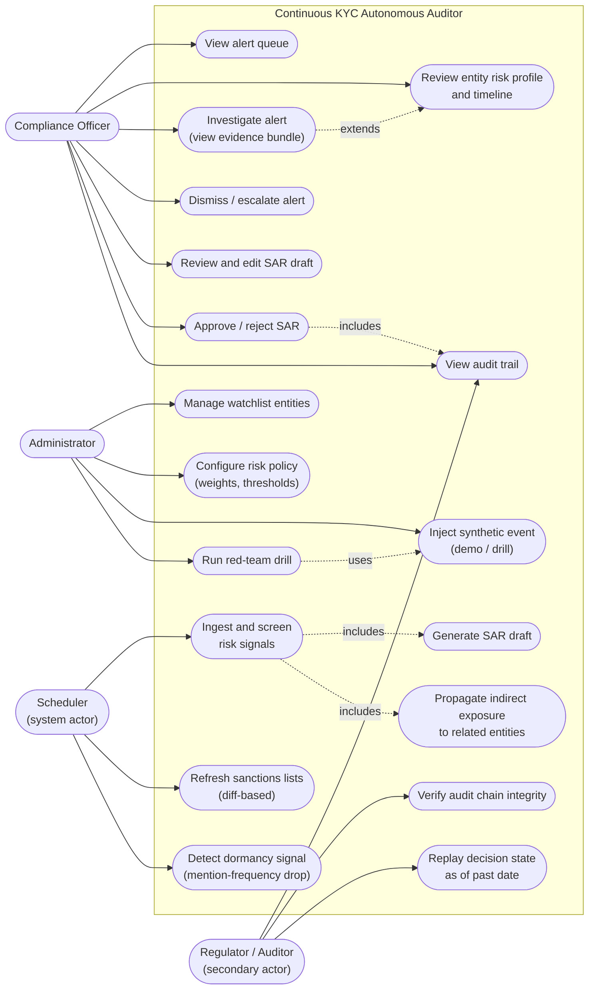
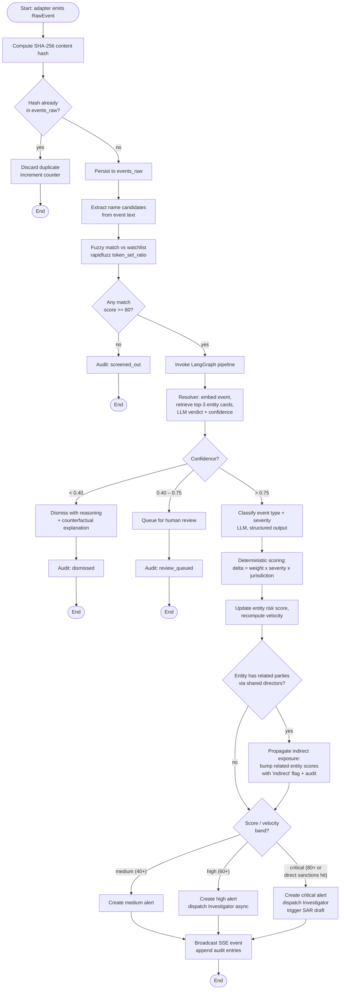
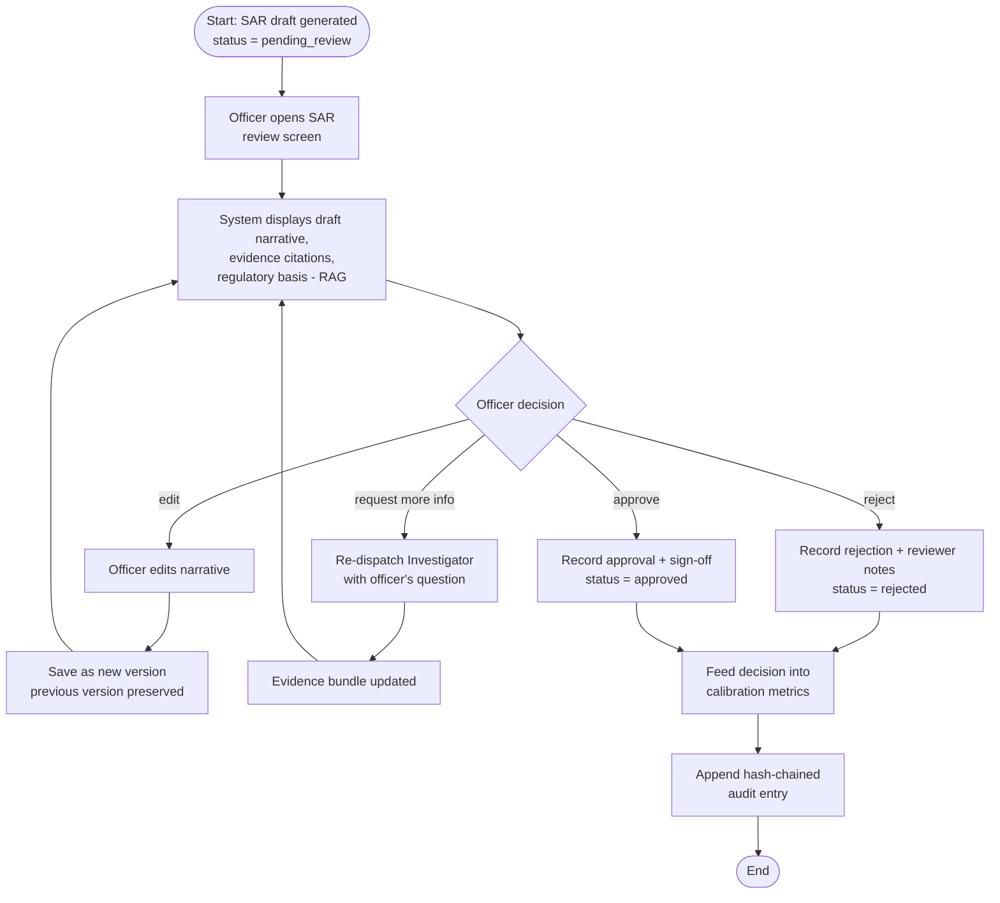
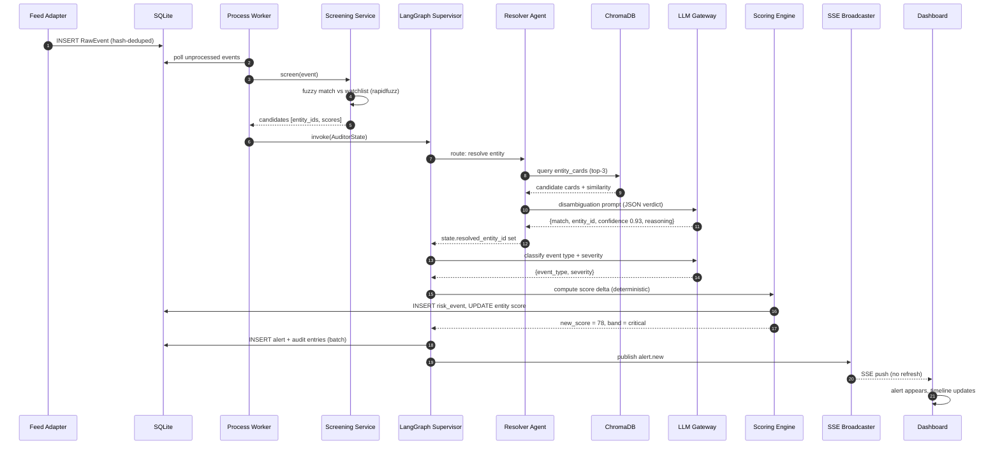
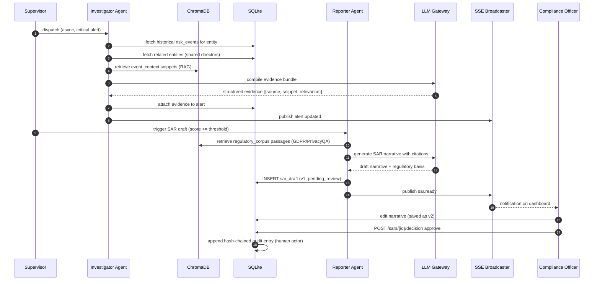
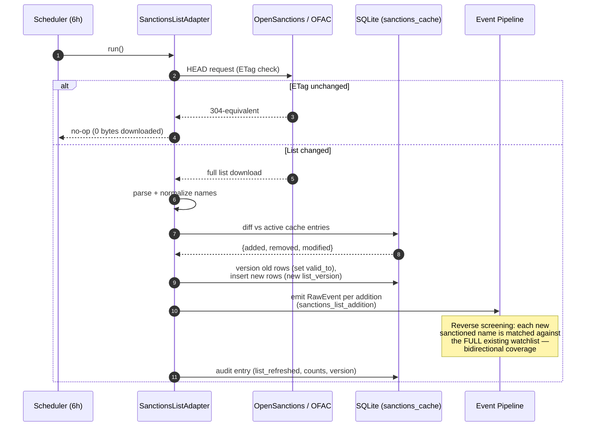
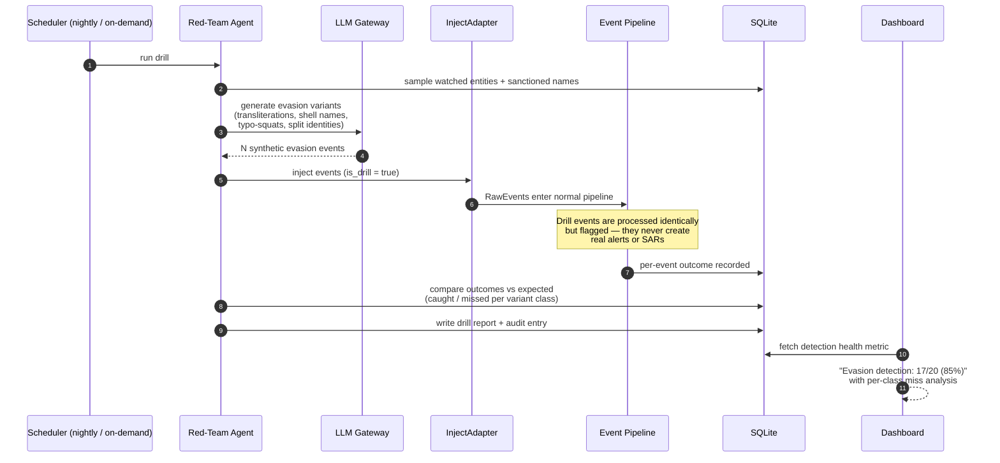
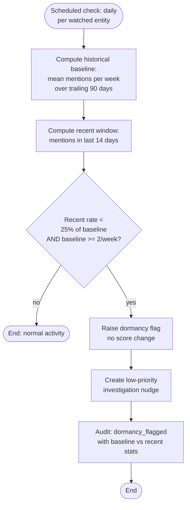

# System Design Document
## Continuous KYC Autonomous Auditor (CXKYC)

**Tech Mahindra CODE Hackathon — Challenge 3**

---

## 1. System Design Methodology

The system is designed using an **iterative, architecture-first methodology** combining three complementary approaches:

**1.1 Layered Architecture Pattern.** The system is decomposed into five horizontal layers (Client, Application, Agent Runtime, Domain Services, Storage), each with a single responsibility and communicating only with adjacent layers. This enforces separation of concerns and allows each layer to be scaled or replaced independently.

**1.2 Event-Driven Architecture (EDA).** All risk signals — adverse media, sanctions list changes, and transaction anomalies — are normalized into a single canonical `RawEvent` structure and processed through one unified pipeline. New data sources are integrated by implementing a `FeedAdapter` interface, never by modifying the pipeline. This is the core extensibility mechanism of the system.

**1.3 Agent-Oriented Design (Supervisor pattern).** Intelligence is decomposed into four specialist agents (Monitor, Resolver, Investigator, Reporter) orchestrated by a LangGraph supervisor over a shared typed state. Routing is deterministic wherever the decision is unambiguous; the LLM is invoked only for judgments that genuinely require semantic reasoning (entity disambiguation, severity classification, narrative generation).

**Design principles applied throughout:**

| Principle | Application |
|---|---|
| Human-in-the-loop | No SAR is ever auto-filed; every escalation requires human sign-off |
| Explainability by construction | Risk scores are computed by a deterministic rule engine; the LLM explains, it does not decide the arithmetic |
| Append-only auditability | Every AI and human decision is written to a tamper-evident, hash-chained audit log; no record is ever mutated |
| Cost-aware AI | Two-stage screening (fuzzy pre-filter → LLM) ensures LLM calls scale sub-linearly with event volume |
| Fail-safe data handling | Feed failures never corrupt cached data; stale data is surfaced visibly rather than hidden |

**Development process:** requirements analysis (problem-statement decomposition) → architecture definition (this document) → data design → component design → iterative implementation in vertical slices (each slice delivers one end-to-end demonstrable behavior) → integration → demo rehearsal.

---

## 2. Technology Stack

| Layer | Technology | Rationale |
|---|---|---|
| Frontend | Vanilla JavaScript (ES6), HTML5, CSS3 | Zero build tooling; SSE-native via `EventSource`; fast to iterate under hackathon constraints |
| Real-time transport | Server-Sent Events (SSE) | Simpler than WebSockets; unidirectional push is sufficient for alert streaming |
| Backend framework | FastAPI (Python 3.11+) | Async-native, automatic OpenAPI docs, Pydantic validation |
| Agent orchestration | LangGraph | Typed shared state, conditional-edge routing, supervisor pattern |
| LLM | Google Gemini (`gemini-3.1-flash-lite` primary, fallback chain) | Cost-efficient; all calls routed through a central LLM Gateway with retry, quota fallback, and response caching |
| Vector store | ChromaDB (3 collections: `entity_cards`, `event_context`, `regulatory_corpus`) | Local, embedded, no infrastructure; semantic entity matching and regulatory RAG |
| Relational store | SQLite (WAL mode) via SQLAlchemy ORM | Zero-ops; WAL enables concurrent dashboard reads during worker writes; ORM makes migration to PostgreSQL a connection-string change |
| Scheduling | APScheduler (asyncio) | Independent ingest and process loops inside the FastAPI lifespan |
| Fuzzy matching | rapidfuzz | High-throughput pre-filter; eliminates ~95% of events before any LLM call |
| ML (transaction monitoring) | scikit-learn (Random Forest) + rule-based typology detectors | Hybrid: model provides recall, rules provide explainable evidence |
| Data preparation | pandas, pyarrow (Parquet) | Stratified sampling of the 9.5M-row SAML-D dataset into a fast-loading working set |
| Configuration | pydantic-settings + YAML risk policy | Runtime-reloadable risk weights and thresholds |
| Datasets | Synthetic KYC profiles, SAML-D, OpenSanctions, OFAC SDN, GDPR/PrivacyQA/OPP-115 | Provided challenge datasets + live-refreshable public sources |

**Production migration path (design intent, not hackathon scope):** SQLite → PostgreSQL; ChromaDB → pgvector; APScheduler → Kafka consumers; SSE fan-out → Redis pub/sub; feed polling → vendor webhooks (Dow Jones, ComplyAdvantage).

---

## 3. System Process Overview

The system operates as three concurrent loops sharing one database:

**Loop A — Ingestion (every 15 s, per adapter schedule).** Each registered `FeedAdapter` (GDELT, GNews, RSS, OpenSanctions, OFAC, TransactionAdapter, InjectAdapter, ProvidedDatasetAdapter) fetches new raw material, normalizes it into `RawEvent` objects (UTC timestamps, stripped HTML, normalized names), and inserts them into `events_raw` guarded by a SHA-256 content-hash uniqueness constraint.

**Loop B — Processing (every 5 s).** Unprocessed events are drawn from `events_raw` and passed through the pipeline: fuzzy screen → LangGraph agent network (resolve → score → route) → alert/SAR outcomes → SSE broadcast. Every stage decision, including dismissals, is appended to the audit log.

**Loop C — Human review (event-driven).** Compliance officers act on alerts and SAR drafts through the dashboard; every human action is recorded in the same audit log, closing the loop and feeding the confidence-calibration metrics.

**Loop D — Self-assessment (scheduled, low frequency).** Two autonomous quality checks run alongside the main loops: the *Red-Team Agent* (nightly or on-demand) injects synthetic evasion attempts through the real pipeline to measure detection quality, and the *Dormancy Detector* (daily) flags watched entities whose media footprint has anomalously vanished — treating the absence of signal as a signal.

---

## 4. Use Case Diagram

**Actor summary:** the *Compliance Officer* is the primary human actor (review and decision workflows); the *Administrator* manages configuration and demo/drill tooling; the *Scheduler* is a system actor driving autonomous behavior; the *Regulator/Auditor* is a secondary actor served by the audit-trail, chain-verification, and decision-replay use cases.

---

## 5. Activity Diagrams

### 5.1 Event Processing Pipeline (core autonomous activity)

### 5.2 SAR Review Workflow (human-in-the-loop activity)

---

## 6. Sequence Diagrams

### 6.1 Adverse Media Event → Live Alert (primary flow)

### 6.2 Critical Alert → Investigation → SAR Approval

### 6.3 Automated Sanctions List Refresh (diff-based)

### 6.4 Red-Team Drill (self-testing detection quality)

### 6.5 Dormancy Detection (absence-of-signal monitoring)

The dormancy check deliberately does **not** alter the risk score — silence is a soft signal warranting attention, not a scored risk event. The `baseline >= 2/week` guard prevents false flags on entities that were never actively covered.

---

## 7. Component Interaction Summary

| Component | Consumes | Produces | Failure behavior |
|---|---|---|---|
| Feed Adapters | External APIs / files | Normalized `RawEvent` rows | Retry with backoff; stale-data warning after 3 failures; never overwrite cache with partial data |
| Screening Service | RawEvents + watchlist | Match candidates | Deterministic; no external dependency |
| LangGraph Supervisor | AuditorState | Routed agent invocations | Deterministic bypass for unambiguous routes |
| LLM Gateway | Agent prompts | Structured JSON responses | Retry → model fallback → cached response → graceful degradation to review queue |
| Scoring Engine | Classified events + policy.yaml | Score deltas, bands, velocity | Pure function; hot-reloadable policy |
| SSE Broadcaster | Domain events | Push to connected clients | Client reconnect via `EventSource` auto-retry |
| Audit Logger | Every decision (AI + human) | Hash-chained append-only log | Write failure blocks the transaction (audit is not optional) |
| Network Propagator | Resolved risk events + `entity_persons` graph | Indirect-exposure score bumps on related entities | Bounded to 1-hop traversal; cycles impossible by construction |
| Red-Team Agent | Watchlist + sanctions samples | Drill events (`is_drill=true`), detection health report | Drill events are sandboxed — never produce real alerts/SARs |
| Dormancy Detector | Historical mention frequency per entity | Dormancy flags + investigation nudges | Pure statistical check; baseline guard prevents cold-start false flags |

---

*Prepared as part of the system design phase for Challenge 3 — Continuous KYC Autonomous Auditor.*