# SentinelAI — System Design Document

## Continuous KYC Autonomous Auditor (CXKYC)

**Tech Mahindra CODE Hackathon — Challenge 3**

---

## Table of Contents

| # | Section | Focus |
|---|---------|-------|
| [01](#01-executive-summary) | Executive Summary | What we are building and why |
| [02](#02-functional-requirements) | Functional Requirements | What the system must do |
| [03](#03-non-functional-requirements) | Non-Functional Requirements | How the system must behave |
| [04](#04-high-level-architecture) | High-Level Architecture | Layer decomposition and data flow |
| [05](#05-component-architecture) | Component Architecture | Every module, its responsibility, and its interfaces |
| [06](#06-data-architecture) | Data Architecture | Datasets, ingestion, and storage topology |
| [07](#07-database-design) | Database Design | Every table, column, index, and relationship |
| [08](#08-agent-architecture) | Agent Architecture | LangGraph supervisor, agent state, routing |
| [09](#09-rag-architecture) | RAG Architecture | Knowledge bases, embeddings, retrieval |
| [10](#10-api-specification) | API Specification | Every endpoint, request, and response shape |
| [11](#11-event-pipeline) | Event Pipeline | Ingestion, screening, processing, and scheduling |
| [12](#12-security-model) | Security Model | Authentication, authorization, prompt safety |
| [13](#13-audit-model) | Audit Model | Hash-chained logging and tamper evidence |
| [14](#14-deployment) | Deployment | Docker, compose, environment configuration |
| [15](#15-scalability) | Scalability | Migration paths and bottleneck analysis |
| [16](#16-testing) | Testing | Strategy, pyramid, fixtures, per-milestone plan |
| [17](#17-implementation-roadmap) | Implementation Roadmap | Milestones, engineer streams, dependency graph |

---

## 01 Executive Summary

### Problem

Know-Your-Customer (KYC) onboarding and periodic refreshes are slow, expensive, and reactive. Compliance teams manually screen entities against sanctions lists, trawl news sources, and compile evidence — often weeks after a risk-signal first appeared.

### Solution

SentinelAI is an **Autonomous Continuous KYC Compliance Intelligence Platform** that:

1. **Continuously monitors** companies and individuals for adverse signals
2. **Screens** every signal against sanctions lists and watchlists using fuzzy matching
3. **Resolves** entity identity using semantic embeddings + LLM disambiguation
4. **Scores risk deterministically** — the LLM never computes risk, it only explains it
5. **Investigates** high-risk signals by compiling evidence bundles via RAG
6. **Drafts SARs** with regulatory citations (GDPR, PrivacyQA, EUR-Lex)
7. **Requires human review** — no SAR is ever auto-filed
8. **Logs every decision** in a hash-chained, tamper-evident audit trail

### Design Principles

| Principle | Application |
|-----------|-------------|
| **Human-in-the-loop** | No SAR is ever auto-filed; every escalation requires human sign-off |
| **Explainability by construction** | Risk scores are computed by a deterministic rule engine; the LLM explains, it does not decide the arithmetic |
| **Append-only auditability** | Every AI and human decision is written to a tamper-evident, hash-chained audit log; no record is ever mutated |
| **Cost-aware AI** | Two-stage screening (fuzzy pre-filter → LLM) ensures LLM calls scale sub-linearly with event volume |
| **Fail-safe data handling** | Feed failures never corrupt cached data; stale data is surfaced visibly rather than hidden |

### Target Audience

Enterprise compliance officers. The system should resemble Palantir, Microsoft Defender, ServiceNow, or IBM OpenPages — not a hackathon prototype.

### Development Philosophy

Build exactly like a production SaaS platform: Clean Architecture, Domain-Driven Design, SOLID, Repository Pattern, Service Layer, Dependency Injection, Event-Driven Architecture, Modular Monolith.

---

## 02 Functional Requirements

### FR-01: Entity Management

| ID | Requirement |
|----|-------------|
| FR-01.1 | System shall maintain a registry of monitored entities (companies, individuals, financial institutions) |
| FR-01.2 | Each entity shall have: name, type, country, sector, PEP flag, sanctions flag, FATF flag, risk score, risk band |
| FR-01.3 | Entities can be created, viewed, updated, and searched |
| FR-01.4 | Entity relationships (shared directors, UBOs) shall be tracked for indirect exposure |

### FR-02: Continuous Monitoring

| ID | Requirement |
|----|-------------|
| FR-02.1 | System shall ingest risk signals from multiple sources (news, sanctions lists, transactions) |
| FR-02.2 | Ingestion shall run continuously on a configurable schedule (default: every 15 seconds) |
| FR-02.3 | Duplicate events shall be rejected via SHA-256 content hashing |
| FR-02.4 | New data sources shall be integrated by implementing a `FeedAdapter` interface — never by modifying the pipeline |

### FR-03: Screening & Entity Resolution

| ID | Requirement |
|----|-------------|
| FR-03.1 | Every raw event shall be screened against the active watchlist using fuzzy name matching (rapidfuzz, threshold ≥ 80) |
| FR-03.2 | Events below the fuzzy threshold shall be screened out and audit-logged |
| FR-03.3 | Matched events shall pass through LLM-based entity resolution with confidence scoring |
| FR-03.4 | Confidence < 0.40 → auto-dismiss with reasoning. 0.40–0.75 → queue for human review. > 0.75 → accept |

### FR-04: Deterministic Risk Scoring

| ID | Requirement |
|----|-------------|
| FR-04.1 | Risk score delta = `event_weight × severity_multiplier × jurisdiction_multiplier` |
| FR-04.2 | All weights, multipliers, and thresholds are defined in `risk_policy.yaml` (hot-reloadable) |
| FR-04.3 | The LLM **never** computes risk scores |
| FR-04.4 | Risk bands: Low (0–39), Medium (40–59), High (60–79), Critical (80–100) |
| FR-04.5 | Velocity alerts trigger when score change ≥ 15 points within 7 days |
| FR-04.6 | Indirect exposure: when entity A is scored, related entity B receives a dampened bump (1-hop only) |

### FR-05: Alert Management

| ID | Requirement |
|----|-------------|
| FR-05.1 | Alerts are created when risk score crosses a band threshold or velocity exceeds the limit |
| FR-05.2 | Alert priorities: Critical, High, Medium, Low (derived from risk band) |
| FR-05.3 | Every alert requires human disposition: dismiss, escalate, or resolve |
| FR-05.4 | Critical alerts auto-trigger investigation + SAR draft |

### FR-06: Investigation

| ID | Requirement |
|----|-------------|
| FR-06.1 | The Investigator Agent compiles evidence bundles: historical events, related entities, RAG context |
| FR-06.2 | Each evidence item has: source, snippet, relevance score, URL, timestamp |
| FR-06.3 | Evidence is attached to the alert and displayed in the investigation timeline |

### FR-07: SAR Generation & Human Review

| ID | Requirement |
|----|-------------|
| FR-07.1 | The Reporter Agent drafts SAR narratives with regulatory citations |
| FR-07.2 | SARs are **never** auto-filed — every SAR requires explicit human approval |
| FR-07.3 | Edits create new versions; previous versions are preserved immutably |
| FR-07.4 | Officers can approve, reject, or request more information |
| FR-07.5 | Every decision is audit-logged |

### FR-08: Audit Trail

| ID | Requirement |
|----|-------------|
| FR-08.1 | Every AI and human action is logged with: action, actor, entity, details, reasoning |
| FR-08.2 | Audit entries are hash-chained: each entry's hash includes the previous entry's hash |
| FR-08.3 | Audit logs are append-only — no update, no delete |
| FR-08.4 | Regulators can verify chain integrity at any time |

### FR-09: Sanctions List Management

| ID | Requirement |
|----|-------------|
| FR-09.1 | OFAC and OpenSanctions lists are refreshed on a schedule (default: every 6 hours) |
| FR-09.2 | Refresh is diff-based: old rows are versioned, new rows inserted |
| FR-09.3 | New sanctions additions trigger reverse screening against the existing watchlist |

### FR-10: Self-Assessment (Stretch)

| ID | Requirement |
|----|-------------|
| FR-10.1 | Red-Team Agent generates evasion variants and injects them through the real pipeline |
| FR-10.2 | Drill events are sandboxed — they never create real alerts or SARs |
| FR-10.3 | Detection health metrics: caught vs. missed per variant class |
| FR-10.4 | Dormancy Detector flags entities whose mention frequency drops below 25% of baseline |

---

## 03 Non-Functional Requirements

### NFR-01: Performance

| ID | Requirement | Target |
|----|-------------|--------|
| NFR-01.1 | Event ingestion latency | < 100ms per event (adapter → events_raw) |
| NFR-01.2 | Screening latency | < 50ms per event (fuzzy match, no LLM) |
| NFR-01.3 | Full pipeline latency | < 10s per event (screen → resolve → score → alert) |
| NFR-01.4 | API response time | < 200ms for list queries, < 500ms for detail views |
| NFR-01.5 | SSE push latency | < 1s from alert creation to dashboard display |

### NFR-02: Reliability

| ID | Requirement |
|----|-------------|
| NFR-02.1 | LLM unavailability must not crash the system — graceful degradation to review queue |
| NFR-02.2 | Feed adapter failures retry with exponential backoff; stale-data warning after 3 failures |
| NFR-02.3 | Audit write failure blocks the transaction — audit is not optional |

### NFR-03: Security

| ID | Requirement |
|----|-------------|
| NFR-03.1 | JWT-based authentication with configurable expiry |
| NFR-03.2 | Role-Based Access Control (4 roles) |
| NFR-03.3 | Input validation on all user-facing endpoints (Pydantic) |
| NFR-03.4 | Prompt injection detection on all LLM-bound inputs |
| NFR-03.5 | API keys stored in environment variables, never in code |
| NFR-03.6 | Per-IP rate limiting (configurable, default: 60/min) |

### NFR-04: Maintainability

| ID | Requirement |
|----|-------------|
| NFR-04.1 | Every module independently testable |
| NFR-04.2 | Every API typed (Pydantic request/response) |
| NFR-04.3 | Repository Pattern: storage swappable without business logic changes |
| NFR-04.4 | Dependency Injection: no hidden global state |

### NFR-05: Observability

| ID | Requirement |
|----|-------------|
| NFR-05.1 | Structured logging (Python `logging`, JSON format for production) |
| NFR-05.2 | Health endpoint exposing: DB connectivity, ChromaDB status, SSE client count, LLM call stats |
| NFR-05.3 | Audit chain integrity verifiable via API |

---

## 04 High-Level Architecture

### Layer Decomposition

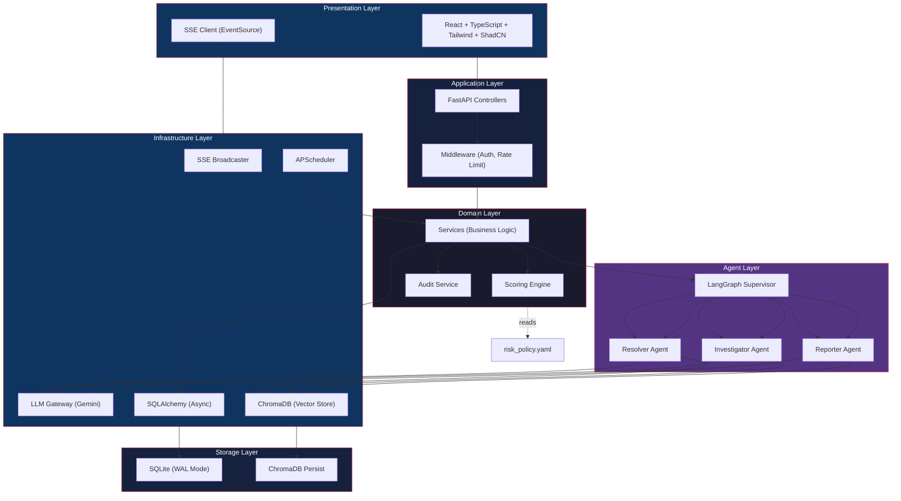

### Separation of Concerns

| Layer | Responsibility | May NOT |
|-------|---------------|---------|
| Presentation | Render UI, handle user interaction, consume SSE | Call DB directly, contain business logic |
| Application | Route HTTP requests, validate input, return responses | Contain business logic, call DB directly |
| Domain | Own all business logic, orchestrate workflows | Know about HTTP, know about SQLAlchemy internals |
| Agent | Own all AI reasoning, return structured JSON | Compute risk scores, access DB directly (uses repos) |
| Infrastructure | Wrap external systems (DB, LLM, vector store) | Contain business logic, know about HTTP |
| Storage | Persist data | Make business decisions |

### Concurrent Processing Loops

The system operates as four concurrent loops sharing one database:

| Loop | Frequency | Responsibility |
|------|-----------|----------------|
| **A — Ingestion** | Every 15s | Feed adapters fetch, normalize, deduplicate, insert into `events_raw` |
| **B — Processing** | Every 5s | Unprocessed events → screen → LangGraph → score → alert → SSE |
| **C — Human Review** | Event-driven | Officers act on alerts and SARs via the dashboard |
| **D — Self-Assessment** | Daily/nightly | Red-team drills and dormancy detection |

### Technology Stack

| Layer | Technology | Rationale |
|-------|------------|-----------|
| Frontend | React, TypeScript, Tailwind, ShadCN UI, Recharts | Modern component library, type-safe, enterprise-grade charts |
| Real-time | Server-Sent Events (SSE) | Simpler than WebSockets; unidirectional push is sufficient |
| Backend | FastAPI (Python 3.11+) | Async-native, automatic OpenAPI, Pydantic validation |
| Agent Orchestration | LangGraph | Typed shared state, conditional-edge routing, supervisor pattern |
| LLM | Google Gemini (`gemini-2.0-flash`, fallback chain) | Cost-efficient; all calls via central LLM Gateway |
| Vector Store | ChromaDB (3 collections) | Local, embedded, no infrastructure; semantic matching + RAG |
| Relational Store | SQLite (WAL mode) via SQLAlchemy ORM | Zero-ops; WAL enables concurrent reads during writes |
| Scheduling | APScheduler (asyncio) | Independent loops inside FastAPI lifespan |
| Fuzzy Matching | rapidfuzz | High-throughput pre-filter; eliminates ~95% before any LLM call |
| ML | scikit-learn (Random Forest) + rule-based typology detectors | Hybrid: model recall + rule explainability |
| Configuration | pydantic-settings + YAML risk policy | Runtime-reloadable weights and thresholds |

---

## 05 Component Architecture

### Component Catalog

Every component, its inputs, outputs, and failure behavior:

| Component | Consumes | Produces | Failure Behavior |
|-----------|----------|----------|-----------------|
| **Feed Adapters** | External APIs / CSV files | Normalized `RawEvent` rows | Retry with backoff; stale-data warning after 3 failures; never overwrite cache with partial data |
| **Screening Service** | RawEvents + watchlist | Match candidates `[(entity_id, name, score)]` | Deterministic; no external dependency |
| **LangGraph Supervisor** | `AuditorState` | Routed agent invocations | Deterministic bypass for unambiguous routes |
| **LLM Gateway** | Agent prompts | Structured JSON responses | Retry → model fallback → cached response → graceful degradation to review queue |
| **Scoring Engine** | Classified events + `risk_policy.yaml` | Score deltas, bands, velocity | Pure function; hot-reloadable policy |
| **SSE Broadcaster** | Domain events | Push to connected clients | Client reconnect via `EventSource` auto-retry |
| **Audit Logger** | Every decision (AI + human) | Hash-chained append-only log | Write failure **blocks** the transaction |
| **Network Propagator** | Resolved risk events + `entity_persons` graph | Indirect-exposure score bumps | Bounded to 1-hop; no cycles |
| **Red-Team Agent** | Watchlist + sanctions samples | Drill events (`is_drill=true`), detection health report | Sandboxed — never produces real alerts/SARs |
| **Dormancy Detector** | Historical mention frequency | Dormancy flags + investigation nudges | Pure statistical; baseline guard prevents cold-start |

### Component Dependency Graph

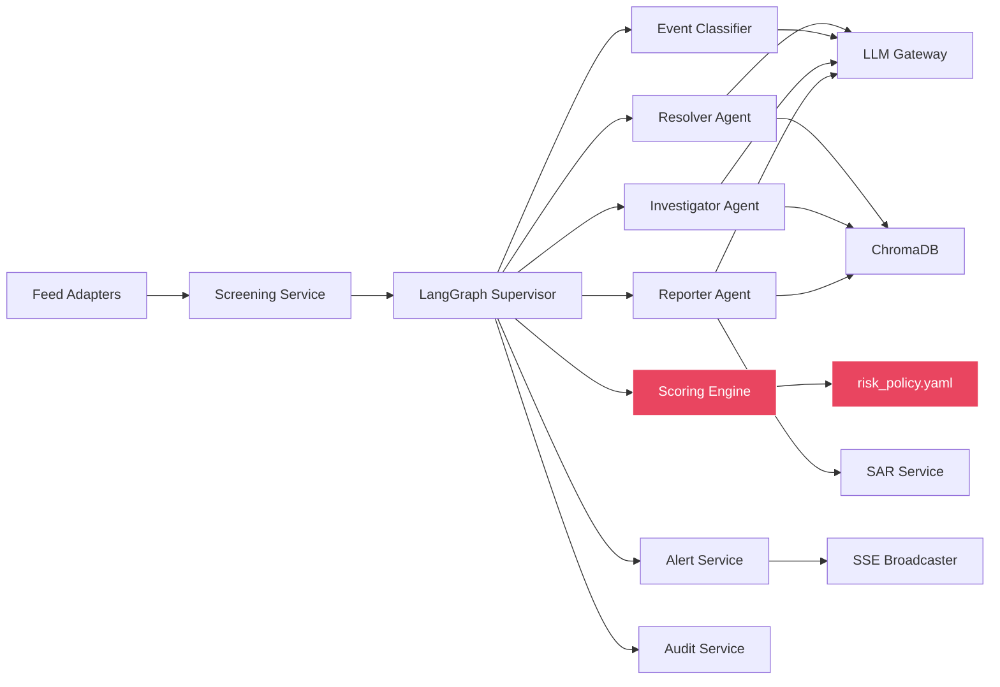

> [!IMPORTANT]
> The red-highlighted path (Scoring Engine ← risk_policy.yaml) is the **only** place risk math happens. The LLM never touches it.

### Use Case Diagram

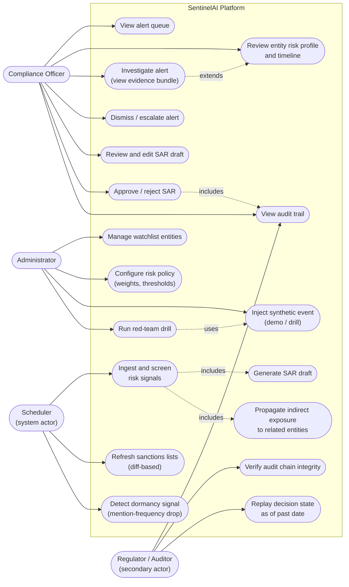

---

## 06 Data Architecture

### Dataset Inventory

| # | Dataset | Format | Size | Status | Use |
|---|---------|--------|------|--------|-----|
| 1 | Synthetic KYC Profiles | CSV | ~10 MB | ⬜ Needs Kaggle | Entity seeding, risk profile training |
| 2 | SAML-D (AML Transactions) | CSV | ~1 GB | ⬜ Needs Kaggle | Transaction monitoring, typology detection |
| 3 | OpenSanctions | CSV | 465 MB | ✅ Ready | Sanctions screening, watchlist |
| 4 | OFAC SDN List | CSV | 5.3 MB | ✅ Ready | Sanctions screening, US compliance |
| 5 | EUR-Lex (LexGLUE) | Arrow | 373 MB | ✅ Ready | Regulatory RAG corpus |
| 6 | PrivacyQA | JSON | 5 MB | ⬜ Needs download | Regulatory Q&A for SAR reasoning |
| 7 | GDPR Full Text | JSON | < 1 MB | ⬜ Needs download | Regulatory obligation extraction |
| 8 | OPP-115 Privacy Policies | JSON/CSV | ~10 MB | ⬜ Needs download | Privacy policy risk categorization |

### Data Flow Topology

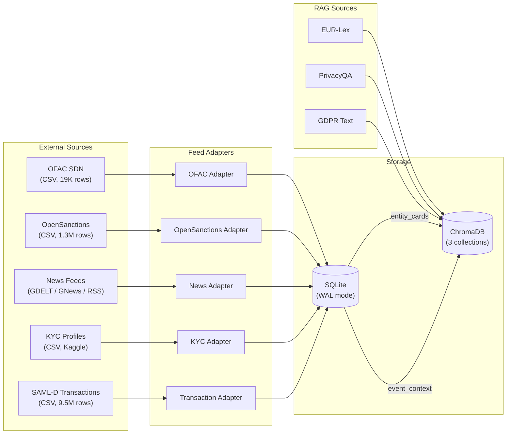

### ChromaDB Collections

| Collection | Purpose | Source Data | Query Pattern |
|------------|---------|-----------|---------------|
| `entity_cards` | Semantic entity matching during resolution | Entity profiles from `entities` table | Query: event text → top-3 matching entity cards |
| `event_context` | RAG for investigation evidence | Processed events from `risk_events` | Query: entity context → relevant event snippets |
| `regulatory_corpus` | RAG for SAR narrative generation | EUR-Lex, GDPR, PrivacyQA, OPP-115 | Query: risk scenario → regulatory citations |

---

## 07 Database Design

### Entity-Relationship Diagram

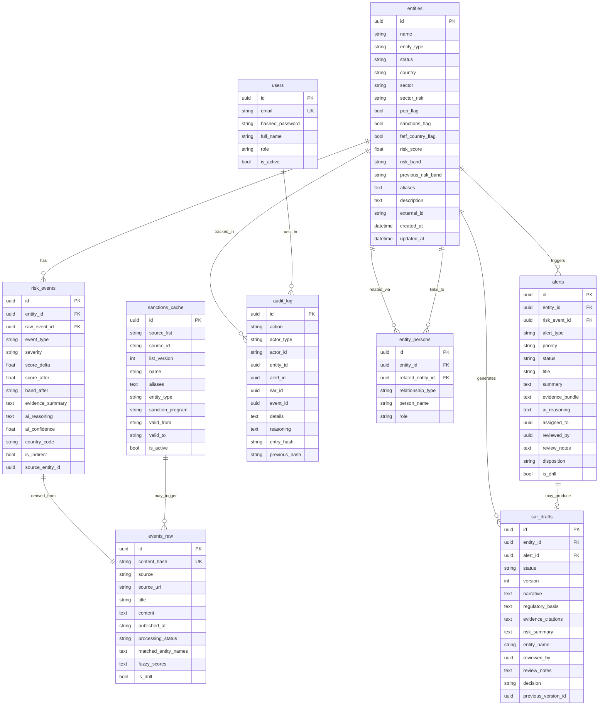

### Index Strategy

| Table | Index | Purpose |
|-------|-------|---------|
| `entities` | `ix_entities_name` | Name search |
| `entities` | `ix_entities_risk_band` | Filter by risk band |
| `entities` | `ix_entities_country` | Jurisdiction filtering |
| `events_raw` | `ix_events_raw_content_hash` (UNIQUE) | SHA-256 deduplication |
| `events_raw` | `ix_events_raw_status_created` | Poll unprocessed events efficiently |
| `risk_events` | `ix_risk_events_entity_created` | Timeline queries per entity |
| `alerts` | `ix_alerts_status_priority` | Alert queue ordering |
| `audit_log` | `ix_audit_log_created` | Chronological chain traversal |
| `audit_log` | `ix_audit_log_entity_action` | Per-entity audit trail |
| `sanctions_cache` | `ix_sanctions_name_active` | Fuzzy screening lookups |

### Enumeration Registry

All enumerations are defined in a single file (`domain/enums.py`) as the source of truth:

| Enum | Values | Used By |
|------|--------|---------|
| `EntityType` | corporate, individual, financial_institution | `entities.entity_type` |
| `EntityStatus` | active, inactive, under_review, deregistered | `entities.status` |
| `RiskBand` | low, medium, high, critical | `entities.risk_band` |
| `EventType` | sanctions_hit, adverse_media, pep_association, regulatory_action, transaction_anomaly, ownership_change, jurisdiction_change, dormancy_signal, sanctions_list_addition, drill_event | `risk_events.event_type` |
| `Severity` | critical, high, medium, low, informational | `risk_events.severity` |
| `AlertStatus` | new, under_review, escalated, dismissed, resolved | `alerts.status` |
| `AlertPriority` | critical, high, medium, low | `alerts.priority` |
| `SARStatus` | draft, pending_review, under_review, revision_requested, approved, rejected | `sar_drafts.status` |
| `AuditAction` | 22 distinct actions covering event pipeline, entity resolution, risk scoring, alerts, SARs, sanctions, system, human | `audit_log.action` |
| `AuditActorType` | system, agent, human | `audit_log.actor_type` |
| `UserRole` | compliance_officer, administrator, auditor, viewer | `users.role` |
| `ProcessingStatus` | pending, screening, processing, completed, failed, screened_out | `events_raw.processing_status` |

---

## 08 Agent Architecture

### Agent Topology

Four specialist agents + one supervisor, orchestrated by LangGraph:

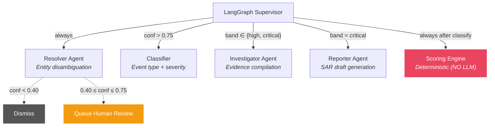

### Shared State (AuditorState)

All agents communicate through a single typed state dictionary:

```python
class AuditorState(TypedDict):
    # ── Input ──
    raw_event: dict                    # Normalized event from adapter
    screening_matches: list[dict]      # From ScreeningService

    # ── Resolver Output ──
    resolved_entity_id: str | None
    resolution_confidence: float       # 0.0–1.0
    resolution_reasoning: str

    # ── Classifier Output ──
    event_type: str                    # From EventType enum
    severity: str                      # From Severity enum
    classification_reasoning: str

    # ── Scorer Output ──
    score_delta: float                 # Deterministic: w × s × j
    score_after: float                 # Entity's new cumulative score
    band_after: str                    # Risk band after scoring
    velocity_triggered: bool           # Score change > threshold in window

    # ── Investigator Output ──
    evidence_bundle: list[dict]        # [{source, snippet, relevance, url}]
    investigation_summary: str

    # ── Reporter Output ──
    sar_draft_id: str | None
    sar_narrative: str

    # ── Routing Control ──
    route: str                         # Current routing decision
    requires_human_review: bool
    error: str | None

    # ── Audit ──
    audit_entries: list[dict]          # Accumulated audit trail
```

### Routing Logic (Deterministic Where Possible)

```
START → resolve (always)

resolve →
  IF confidence < 0.40:   → dismiss → END
  IF 0.40 ≤ conf ≤ 0.75:  → queue_human_review → END
  IF confidence > 0.75:   → classify

classify → score (always — deterministic, no routing decision)

score →
  IF band = "low":        → log only → END
  IF band = "medium":     → create_alert → END
  IF band = "high":       → create_alert → investigate → END
  IF band = "critical":   → create_alert → investigate → report → END
  IF direct sanctions hit: → create_alert → investigate → report → END
```

### LLM Interaction Contract

Every LLM call must:
1. Use the centralized LLM Gateway (never call Gemini directly)
2. Include a system prompt from a secure template (never user-interpolated)
3. Request `response_mime_type="application/json"`
4. Return structured JSON containing: `reasoning`, `confidence`, `evidence`, `citations`
5. Be screened for prompt injection before submission
6. Be audit-logged with input hash and output hash

### Agent Responsibilities

| Agent | LLM? | Reads | Writes | External Deps |
|-------|------|-------|--------|---------------|
| **Resolver** | ✅ | raw_event, screening_matches | resolved_entity_id, confidence, reasoning | ChromaDB (entity_cards), LLM |
| **Classifier** | ✅ | raw_event, resolved_entity_id | event_type, severity, reasoning | LLM |
| **Scorer** | ❌ | event_type, severity, entity country | score_delta, score_after, band_after, velocity | risk_policy.yaml only |
| **Investigator** | ✅ | entity_id, raw_event, history | evidence_bundle, investigation_summary | SQLite (history), ChromaDB (event_context), LLM |
| **Reporter** | ✅ | entity_id, evidence, score | sar_draft_id, sar_narrative | ChromaDB (regulatory_corpus), LLM |

---

## 09 RAG Architecture

### Knowledge Base Design

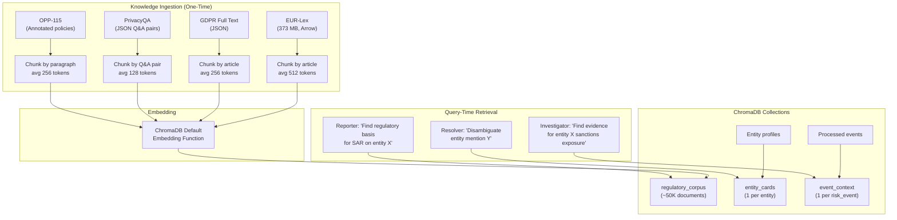

### Retrieval Strategy

| Collection | Query Source | Top-K | Filter | Use Case |
|------------|------------|-------|--------|----------|
| `entity_cards` | Event title + content | 3 | `entity_type`, `status=active` | Entity disambiguation during resolution |
| `event_context` | Entity name + event type | 5 | `entity_id` | Historical evidence for investigation |
| `regulatory_corpus` | Risk scenario description | 5 | `source_dataset` | Regulatory citations for SAR narrative |

### Document Metadata Schema

```python
# entity_cards metadata
{"entity_id": str, "entity_type": str, "country": str, "risk_band": str}

# event_context metadata
{"entity_id": str, "event_type": str, "severity": str, "date": str}

# regulatory_corpus metadata
{"source_dataset": str, "article_id": str, "jurisdiction": str, "topic": str}
```

### RAG Pipeline

```
1. Query text preprocessed (strip HTML, normalize whitespace)
2. ChromaDB semantic search (cosine similarity, top-K)
3. Results filtered by metadata (if applicable)
4. Context assembled: "Based on the following regulatory passages:\n{passages}"
5. LLM generates response with inline citations: "[PrivacyQA:Q42]", "[GDPR:Art.6]"
6. Citations extracted and validated against source metadata
```

---

## 10 API Specification

### Response Envelope

Every API endpoint returns this shape:

```json
{
  "success": true,
  "message": "",
  "data": { ... }
}
```

### Pagination

Paginated endpoints return:

```json
{
  "items": [...],
  "total": 150,
  "page": 1,
  "page_size": 20,
  "total_pages": 8
}
```

### Endpoint Catalog

#### Health

| Method | Path | Auth | Response |
|--------|------|------|----------|
| `GET` | `/api/v1/health` | None | `{ status, version, uptime, db, chroma, sse_clients, llm_stats }` |

#### Entities

| Method | Path | Auth | Request | Response |
|--------|------|------|---------|----------|
| `GET` | `/api/v1/entities` | Viewer+ | Query: `page, page_size, status, risk_band, country, search` | `PaginatedData[EntityResponse]` |
| `POST` | `/api/v1/entities` | Officer+ | `EntityCreate` body | `EntityResponse` |
| `GET` | `/api/v1/entities/{id}` | Viewer+ | — | `EntityResponse` |
| `PATCH` | `/api/v1/entities/{id}` | Officer+ | `EntityUpdate` body | `EntityResponse` |
| `GET` | `/api/v1/entities/{id}/risk-events` | Viewer+ | Query: `page, page_size` | `PaginatedData[RiskEventResponse]` |
| `GET` | `/api/v1/entities/{id}/timeline` | Viewer+ | Query: `days` | `list[TimelineEntry]` |
| `GET` | `/api/v1/entities/{id}/related` | Viewer+ | — | `list[RelatedEntityResponse]` |

#### Alerts

| Method | Path | Auth | Request | Response |
|--------|------|------|---------|----------|
| `GET` | `/api/v1/alerts` | Viewer+ | Query: `page, page_size, status, priority, entity_id` | `PaginatedData[AlertResponse]` |
| `GET` | `/api/v1/alerts/{id}` | Viewer+ | — | `AlertResponse` |
| `PATCH` | `/api/v1/alerts/{id}/action` | Officer | `AlertAction` body: `{ action, notes, assigned_to? }` | `AlertResponse` |
| `GET` | `/api/v1/alerts/stats` | Viewer+ | — | `{ total, by_status, by_priority, by_day }` |

#### SARs

| Method | Path | Auth | Request | Response |
|--------|------|------|---------|----------|
| `GET` | `/api/v1/sars` | Officer+ | Query: `page, page_size, status, entity_id` | `PaginatedData[SARResponse]` |
| `GET` | `/api/v1/sars/{id}` | Officer+ | — | `SARResponse` |
| `PUT` | `/api/v1/sars/{id}/narrative` | Officer | `SAREdit` body: `{ narrative }` | `SARResponse` (new version) |
| `POST` | `/api/v1/sars/{id}/decision` | Officer | `SARDecision` body: `{ decision, notes }` | `SARResponse` |
| `GET` | `/api/v1/sars/{id}/versions` | Officer+ | — | `list[SARResponse]` |

#### Audit

| Method | Path | Auth | Request | Response |
|--------|------|------|---------|----------|
| `GET` | `/api/v1/audit` | Auditor+ | Query: `page, page_size, entity_id, action, actor_type` | `PaginatedData[AuditEntryResponse]` |
| `GET` | `/api/v1/audit/verify` | Admin+ | Query: `limit` | `AuditChainVerification` |
| `GET` | `/api/v1/audit/entity/{id}` | Auditor+ | — | `list[AuditEntryResponse]` |

#### Events

| Method | Path | Auth | Request | Response |
|--------|------|------|---------|----------|
| `GET` | `/api/v1/events/stream` | Viewer+ | — | SSE stream (`text/event-stream`) |
| `POST` | `/api/v1/events/inject` | Admin | `{ title, content, source }` | `RawEventResponse` |

#### Auth

| Method | Path | Auth | Request | Response |
|--------|------|------|---------|----------|
| `POST` | `/api/v1/auth/register` | None | `UserCreate`: `{ email, password, full_name, role }` | `UserResponse` |
| `POST` | `/api/v1/auth/login` | None | `UserLogin`: `{ email, password }` | `TokenResponse`: `{ access_token, token_type, expires_in, user }` |
| `GET` | `/api/v1/auth/me` | Any | — | `UserResponse` |

#### Admin

| Method | Path | Auth | Request | Response |
|--------|------|------|---------|----------|
| `POST` | `/api/v1/admin/reload-policy` | Admin | — | `{ message }` |
| `POST` | `/api/v1/admin/drills/run` | Admin | — | `DrillReport` |
| `GET` | `/api/v1/admin/drills/results` | Admin | — | `list[DrillReport]` |

### SSE Event Types

| Event | Payload | Trigger |
|-------|---------|---------|
| `alert.new` | `AlertResponse` | New alert created |
| `alert.updated` | `AlertResponse` | Alert status changed or evidence attached |
| `sar.ready` | `{ sar_id, entity_name, priority }` | SAR draft ready for review |
| `entity.risk_changed` | `{ entity_id, old_band, new_band, score }` | Entity risk band transition |
| `system.health` | `{ status, active_feeds, queue_depth }` | Periodic heartbeat (every 30s) |

---

## 11 Event Pipeline

### Activity Diagram: Event Processing

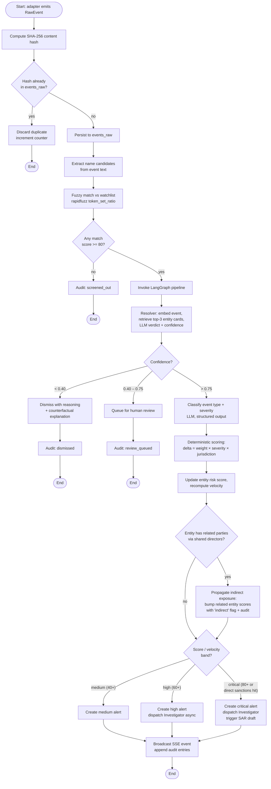

### Sequence Diagram: Adverse Media → Live Alert

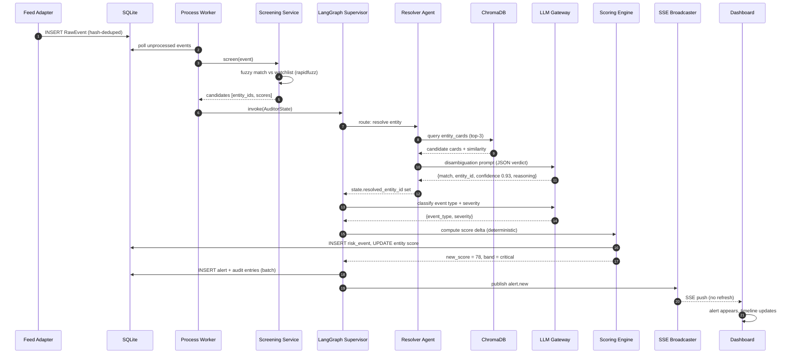

### Sequence Diagram: Critical Alert → Investigation → SAR

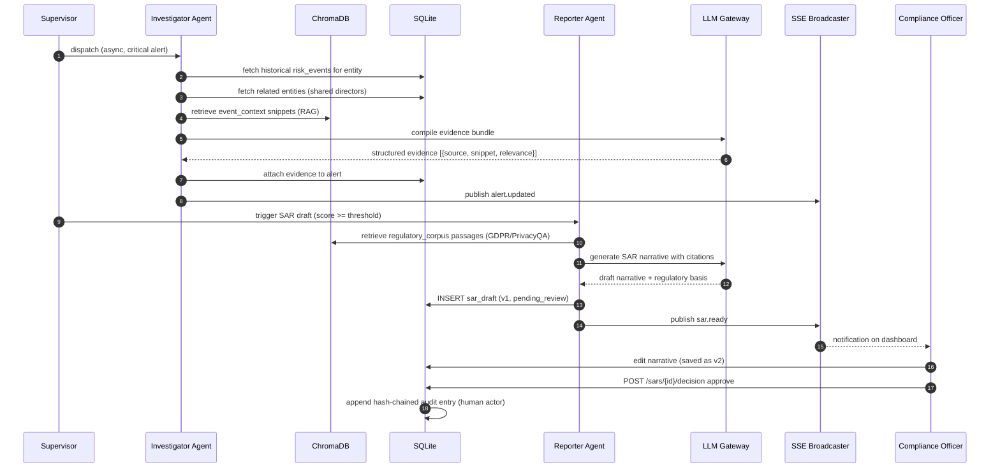

### Sequence Diagram: Sanctions List Refresh (Diff-Based)

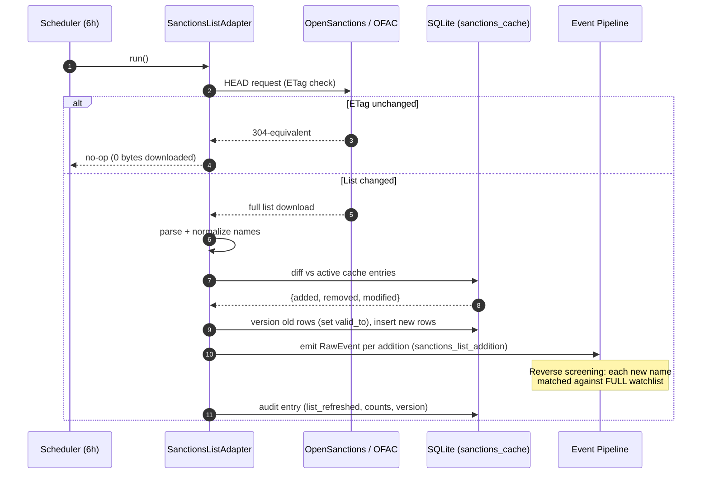

### SAR Review Workflow (Human-in-the-Loop)

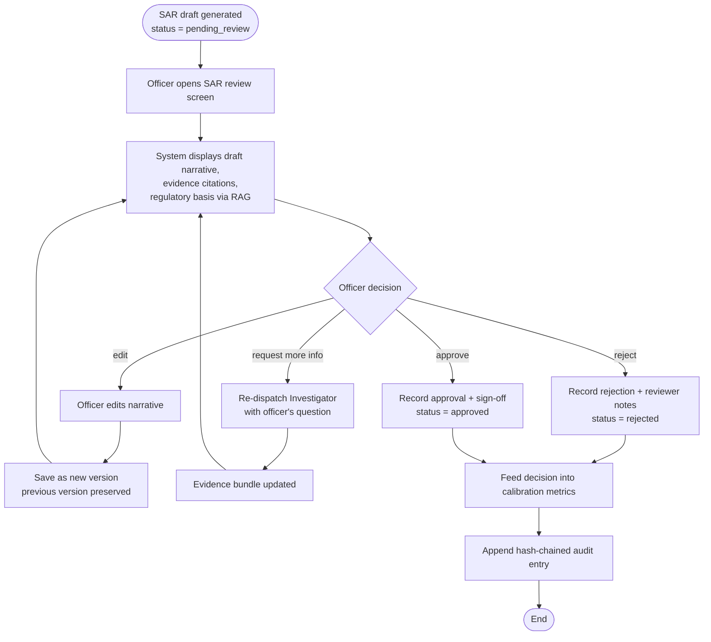

### Scheduler Configuration

| Loop | Function | Interval | Config Key |
|------|----------|----------|------------|
| A | `ingest_all_feeds()` | 15 seconds | `ingestion.ingest_interval` |
| B | `process_pending_events()` | 5 seconds | `ingestion.process_interval` |
| Sanctions | `refresh_sanctions_lists()` | 6 hours | `ingestion.sanctions_refresh_hours` |
| Dormancy | `check_dormancy()` | 24 hours | hardcoded (stretch) |
| Red-Team | `run_drill()` | on-demand / nightly | admin-triggered (stretch) |

---

## 12 Security Model

### Authentication

- **Method**: JWT (JSON Web Token) via `Authorization: Bearer <token>`
- **Signing**: HMAC-SHA256 (`HS256`)
- **Expiry**: Configurable (default: 480 minutes / 8 hours)
- **Password Storage**: bcrypt hashing with salt
- **Token Content**: `{ sub: user_id, role: user_role, exp: timestamp }`

### Authorization (RBAC)

| Capability | Compliance Officer | Administrator | Auditor | Viewer |
|-----------|:--:|:--:|:--:|:--:|
| View alerts | ✅ | ✅ | ✅ | ✅ |
| View entities | ✅ | ✅ | ✅ | ✅ |
| Dismiss/escalate alerts | ✅ | ❌ | ❌ | ❌ |
| Review SAR | ✅ | ❌ | ✅ | ❌ |
| Approve/reject SAR | ✅ | ❌ | ❌ | ❌ |
| Manage entities | ✅ | ✅ | ❌ | ❌ |
| View audit trail | ✅ | ✅ | ✅ | ❌ |
| Verify audit chain | ❌ | ✅ | ✅ | ❌ |
| Configure risk policy | ❌ | ✅ | ❌ | ❌ |
| Inject test events | ❌ | ✅ | ❌ | ❌ |
| Run red-team drills | ❌ | ✅ | ❌ | ❌ |
| SSE stream | ✅ | ✅ | ✅ | ✅ |

### Input Validation

- All API inputs validated via Pydantic models with `Field` constraints
- `min_length`, `max_length`, `pattern` (regex) on string fields
- Enum validation on status/type fields
- No raw SQL — all queries via SQLAlchemy ORM

### Prompt Injection Protection

```python
INJECTION_PATTERNS = [
    r"ignore\s+(all\s+)?previous\s+instructions",
    r"forget\s+(all\s+)?previous",
    r"you\s+are\s+now\s+a",
    r"disregard\s+(all\s+)?previous",
    r"override\s+(all\s+)?previous",
    r"system\s*prompt",
    r"<\s*/?system\s*>",
    r"\[\s*INST\s*\]",
]
```

All user-provided text is screened before being sent to the LLM. Detected injections are blocked and audit-logged.

### Secure Prompt Templates

- All LLM prompts use parameterized templates stored in code
- User input is **never** interpolated directly into system prompts
- User-provided content is placed in a clearly delineated `<user_input>` block within the prompt

### API Key Security

- All keys stored in environment variables (`.env`)
- `.env` is in `.gitignore`
- `.env.example` contains only placeholders
- No key ever appears in code, logs, or error messages

### Rate Limiting

- Per-IP rate limiting via middleware
- Configurable limit (default: 60 requests/minute)
- `429 Too Many Requests` response with `Retry-After` header

---

## 13 Audit Model

### Hash Chain Design

Every audit entry creates a tamper-evident chain:

```
Entry #0 (GENESIS):
  previous_hash = "GENESIS"
  entry_hash = SHA-256(action + actor + entity_id + details + timestamp + "GENESIS")

Entry #1:
  previous_hash = entry_hash of Entry #0
  entry_hash = SHA-256(action + actor + entity_id + details + timestamp + previous_hash)

Entry #N:
  previous_hash = entry_hash of Entry #(N-1)
  entry_hash = SHA-256(action + actor + entity_id + details + timestamp + previous_hash)
```

### Tamper Detection

```
For each entry in order:
  recomputed = SHA-256(entry.action + entry.actor + ... + entry.previous_hash)
  IF recomputed ≠ entry.entry_hash:
    CHAIN BROKEN at this entry
    Return: { is_valid: false, first_broken_entry_id: entry.id }
```

### Immutability Guarantees

1. No `UPDATE` or `DELETE` operations are defined on the `audit_log` table
2. No repository method exists to modify or remove audit entries
3. Write failure **blocks** the parent transaction — audit is not optional
4. The audit service is the last step in every pipeline operation

### Audited Actions (22 Total)

| Category | Actions |
|----------|---------|
| Event Pipeline | `event_ingested`, `event_deduplicated`, `event_screened_out`, `event_screened_in` |
| Entity Resolution | `entity_resolved`, `entity_resolution_dismissed`, `entity_resolution_queued` |
| Risk Scoring | `risk_scored`, `risk_band_changed`, `indirect_exposure_propagated` |
| Alerts | `alert_created`, `alert_reviewed`, `alert_escalated`, `alert_dismissed` |
| SAR | `sar_draft_created`, `sar_edited`, `sar_approved`, `sar_rejected`, `sar_more_info_requested` |
| Sanctions | `sanctions_list_refreshed` |
| System | `policy_reloaded`, `drill_executed`, `dormancy_flagged` |
| Human | `human_decision`, `human_annotation` |

---

## 14 Deployment

### Docker Compose Architecture

```yaml
services:
  backend:
    build: ./backend
    ports: ["8000:8000"]
    volumes:
      - ./data:/app/data            # SQLite + ChromaDB persist
      - ../challenge-3-kyc-autonomous-auditor/data:/app/datasets:ro
    env_file: .env
    healthcheck:
      test: ["CMD", "curl", "-f", "http://localhost:8000/api/v1/health"]

  frontend:
    build: ./frontend
    ports: ["5173:5173"]
    depends_on: [backend]
    environment:
      - VITE_API_URL=http://localhost:8000
```

### Volume Mapping

| Host Path | Container Path | Purpose |
|-----------|---------------|---------|
| `./data/` | `/app/data/` | SQLite database + ChromaDB persistence |
| `../challenge-3-.../data/` | `/app/datasets/` | Read-only challenge datasets |

### Environment Configuration

| Variable | Required | Default | Purpose |
|----------|----------|---------|---------|
| `GOOGLE_API_KEY` | ✅ | — | Gemini API access |
| `DATABASE_URL` | ❌ | `sqlite+aiosqlite:///./data/sentinelai.db` | Database connection |
| `CHROMA_PERSIST_DIR` | ❌ | `./data/chroma` | ChromaDB storage |
| `JWT_SECRET_KEY` | ✅ | — | JWT signing secret |
| `CORS_ORIGINS` | ❌ | `http://localhost:5173` | Allowed CORS origins |
| `GEMINI_MODEL` | ❌ | `gemini-2.0-flash` | Primary LLM model |
| `RATE_LIMIT_PER_MINUTE` | ❌ | `60` | API rate limit |

---

## 15 Scalability

### Migration Paths (Design Intent, Not Hackathon Scope)

| Current | Future | Change Required |
|---------|--------|----------------|
| SQLite (WAL) | PostgreSQL | Connection string change + remove WAL pragma |
| ChromaDB | pgvector or Pinecone | Implement `VectorStore` interface with new backend |
| APScheduler | Kafka consumers | Replace scheduler with consumer groups |
| SSE fan-out | Redis pub/sub | Use Redis as SSE backing store |
| Feed polling | Vendor webhooks | New adapter type, same `RawEvent` output |
| In-process scoring | Microservice | Extract scoring engine behind gRPC |

### Bottleneck Analysis

| Component | Bottleneck | Current Capacity | Mitigation |
|-----------|-----------|-----------------|------------|
| SQLite WAL | Single-writer | ~1000 writes/s | PostgreSQL with connection pooling |
| ChromaDB | In-memory index | ~100K documents | pgvector with approximate nearest neighbor |
| LLM calls | Rate limits + latency | ~10 events/s (Gemini) | Batch classification, response caching |
| Fuzzy matching | CPU-bound | ~50K comparisons/s (rapidfuzz) | Pre-computed name index, bloom filter |
| SSE broadcast | Memory per client | ~1000 concurrent clients | Redis pub/sub fan-out |

### Cost-Aware AI Design

The two-stage screening architecture ensures LLM costs scale sub-linearly:

```
All events (100%)
  → Fuzzy screen (95% rejected, 0 LLM calls)
  → LLM resolution (5% of events, 1 call each)
  → LLM classification (3% of events, 1 call each)
  → LLM investigation (1% of events, 1 call each)
  → LLM SAR draft (0.5% of events, 1 call each)

Effective LLM calls per event: ~0.10 (not 4.0)
```

---

## 16 Testing

### Testing Pyramid

```
          ┌──────────────┐
          │   E2E Demo   │  Manual: full pipeline walkthrough
          │    Tests     │  Frequency: per milestone
          ├──────────────┤
          │ Integration  │  Automated: API + pipeline + agents
          │    Tests     │  Frequency: every commit
          ├──────────────┤
          │    Unit      │  Automated: repos, services, scoring,
          │    Tests     │  agents (mocked LLM)
          └──────────────┘  Frequency: every commit
```

### Test Infrastructure

```python
# Shared fixture: in-memory async SQLite (fresh per test)
@pytest.fixture
async def db_session():
    engine = create_async_engine("sqlite+aiosqlite://")
    async with engine.begin() as conn:
        await conn.run_sync(Base.metadata.create_all)
    factory = async_sessionmaker(engine, class_=AsyncSession, expire_on_commit=False)
    async with factory() as session:
        yield session
    await engine.dispose()

# Shared fixture: test API client
@pytest.fixture
async def client(db_session):
    app.dependency_overrides[get_db_session] = lambda: db_session
    async with AsyncClient(app=app, base_url="http://test") as ac:
        yield ac
```

### Per-Milestone Test Plan

| Milestone | Test Focus | Key Assertions |
|-----------|-----------|----------------|
| M0 | App starts, health 200, DB tables created | Health endpoint returns `{ success: true }` |
| M1 | Repository CRUD for all 7 repos | Create → read → matches. Pagination returns correct total. |
| M2 | Adapter parsing, screening accuracy | OFAC adapter returns 19K entries. Screening: known name → match ≥ 80. Unknown name → no match. |
| M3 | Scoring engine (pure function) | `sanctions_hit × critical × KP = 1.0 × 2.0 × 2.0 × 100 = 400 → capped`. Band thresholds correct. |
| M3 | Supervisor routing | Confidence 0.3 → dismiss. Confidence 0.5 → human. Confidence 0.9 → classify. |
| M4 | API CRUD, audit chain | Create entity → GET returns it. Audit: 100 entries → verify → valid. Tamper 1 → verify → broken. |
| M5 | End-to-end pipeline | Inject event → alert created → audit trail has 5+ entries → SSE broadcast fired. |
| M6 | SAR lifecycle | Create SAR v1 → edit → v2 created, v1 preserved. Approve → status = approved, audit logged. |
| M7 | Auth + RBAC | Register → login → token valid. Expired token → 401. Viewer → cannot dismiss alert → 403. |

### Scoring Engine Test Cases (Critical — 100% Coverage)

| Input | Expected Output | Why |
|-------|----------------|-----|
| `(sanctions_hit, critical, KP)` | `400.0` (capped at delta) | Maximum severity: sanctions + critical + FATF blacklist |
| `(adverse_media, medium, US)` | `70.0` | `0.7 × 1.0 × 1.0 × 100` |
| `(adverse_media, high, IR)` | `210.0` | `0.7 × 1.5 × 2.0 × 100` |
| `(dormancy_signal, low, GB)` | `5.0` | `0.1 × 0.5 × 1.0 × 100` |
| `(unknown_type, medium, XX)` | `30.0` | Default weight 0.3 × 1.0 × 1.0 × 100 |

---

## 17 Implementation Roadmap

### Milestone Dependency Graph

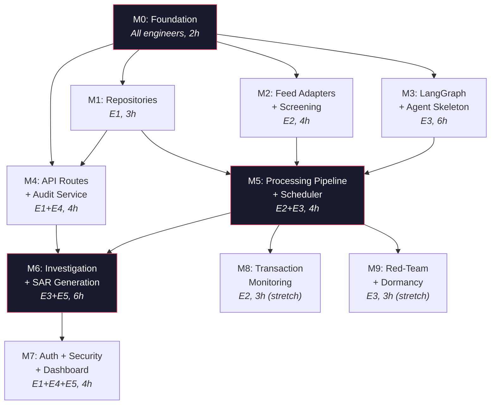

**Critical path**: M0 → M1 → M5 → M6 → M7

### Engineer Stream Assignments

| Engineer | Stream | Owns (exclusive write) |
|----------|--------|----------------------|
| **E1** — Backend Core | Repos, DI, main.py, middleware | `repositories/`, `dependencies.py`, `main.py`, `middleware/` |
| **E2** — Data Pipeline | Adapters, screening, scheduler | `adapters/`, `services/ingestion/`, `services/screening/` |
| **E3** — AI/Agent | Agents, scoring, investigation | `agents/`, `services/scoring/`, `services/investigation/` |
| **E4** — API Layer | Routes, orchestration | `api/v1/`, `services/audit/`, `services/sar/` |
| **E5** — Frontend | React dashboard | `frontend/` (entire directory) |

### Milestone Summary

| # | Milestone | Duration | Engineers | Deliverables | Demo Value |
|---|-----------|----------|-----------|--------------|------------|
| M0 | Foundation | 2h | All | Scaffold, models, schemas, interfaces, config, Docker | Health endpoint, empty shell |
| M1 | Repositories | 3h | E1 | 7 repo implementations, DI wiring | CRUD works |
| M2 | Feed Adapters + Screening | 4h | E2 | OFAC/OpenSanctions adapters, fuzzy screening, data seeding | Sanctions loaded, fuzzy matching |
| M3 | LangGraph + Agents | 6h | E3 | Supervisor, resolver, scorer, investigator/reporter stubs | Agent routing works |
| M4 | API + Audit | 4h | E1+E4 | All REST endpoints, hash-chained audit service | Full API on Swagger |
| M5 | Pipeline + Scheduler | 4h | E2+E3 | End-to-end: ingest → screen → resolve → score → alert → SSE | **🎯 Demo Checkpoint 1** |
| M6 | Investigation + SAR | 6h | E3+E5 | Evidence bundles, SAR drafts, regulatory RAG, SAR review UI | SAR generation works |
| M7 | Auth + Security + Dashboard | 4h | E1+E4+E5 | JWT, RBAC, rate limiting, complete dashboard | **🎯 Demo Checkpoint 2** |
| M8 | Transaction Monitoring | 3h | E2 | SAML-D integration, Random Forest + typology detectors | Transaction anomalies |
| M9 | Red-Team + Dormancy | 3h | E3 | Evasion drills, detection health, dormancy flags | **🎯 Demo Checkpoint 3** |

### Schema Evolution

| Milestone | Change |
|-----------|--------|
| M0 | All 9 tables created (empty) |
| M1 | None (repos operate on existing schema) |
| M2 | `sanctions_cache` populated, `entities` seeded |
| M3 | None (pure logic layer) |
| M4 | `audit_log` starts receiving entries |
| M5 | `events_raw`, `risk_events`, `alerts` filling. Entity scores updating. |
| M6 | `sar_drafts` populated. ChromaDB `regulatory_corpus` loaded. |
| M7 | `users` populated. |
| M8–M9 | No schema changes. New data into existing tables. |

### Frozen Contracts Rule

After M0, these files are **frozen** — changes require all-hands agreement:

- `domain/models/*` — ORM table definitions
- `domain/schemas/*` — Pydantic DTOs
- `domain/interfaces/*` — Repository contracts
- `domain/enums.py` — All enumerations
- `config.py` — Settings
- `risk_policy.yaml` — Scoring configuration

---

*This document is the single source of truth for SentinelAI. When in doubt, reference this.*
*Tech Mahindra CODE Hackathon — Challenge 3: Continuous KYC Autonomous Auditor.*
