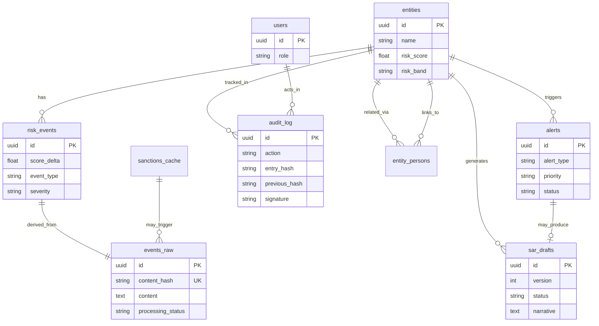
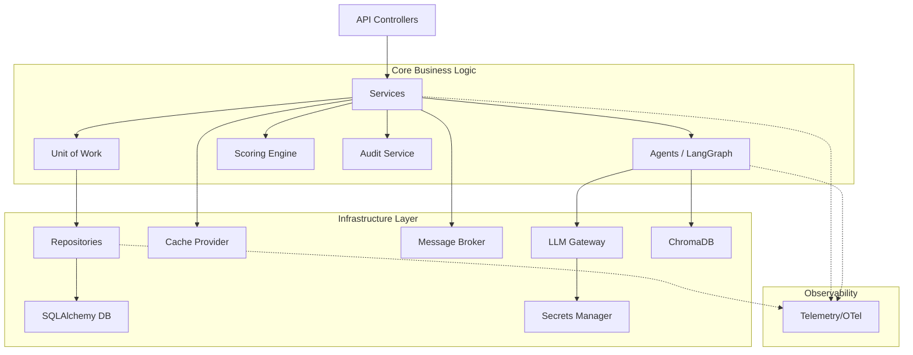
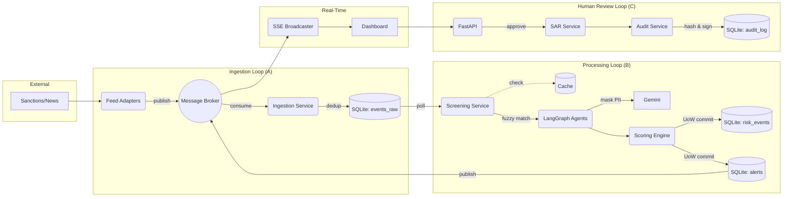

# SentinelAI — Phase 0: Engineering Contract (Enterprise Revision)

> **Law of the Project**: This document defines the engineering contracts, layouts, standards, and strategies that dictate all implementation phases. It contains no business logic, no UI, and no AI — only the contracts that govern them.
> 
> *Architectural Review Note*: This revision hardens the system for Fortune 500 deployment. It introduces enterprise abstractions (Unit of Work, Message Brokers, Telemetry, PII Masking) while preserving backward compatibility. Initial milestones will use local/in-memory implementations of these interfaces to maintain hackathon development speed, enabling seamless migration to distributed infrastructure (Redis/Kafka/PostgreSQL) later.

---

## 1. Complete Folder Structure
## 2. Monorepo Layout
## 3. Backend Package Structure
## 4. Frontend Package Structure
## 26. Complete Project Tree

```text
TECHM/                              # Monorepo Root
├── .env.example                    # Environment variable template
├── .gitignore                      # Git exclusions
├── docker-compose.yml              # Container orchestration (App + Redis + Telemetry)
├── README.md                       # Project constitution
├── SYSTEM_DESIGN.md                # System design document
├── ENGINEERING_CONTRACT.md         # THIS DOCUMENT
│
├── backend/                        # Backend Application (FastAPI + Python)
│   ├── Dockerfile                  # Backend container build instructions
│   ├── requirements.txt            # Python dependencies
│   ├── risk_policy.yaml            # Hot-reloadable risk configuration
│   ├── tests/                      # Backend Test Suite
│   │   ├── __init__.py
│   │   ├── conftest.py             # Shared fixtures (DB, Client, Redis Mock)
│   │   ├── test_adapters/          
│   │   ├── test_agents/            
│   │   ├── test_api/               
│   │   ├── test_audit/             
│   │   ├── test_pipeline/          
│   │   ├── test_repositories/      
│   │   ├── test_sar/               
│   │   ├── test_scoring/           
│   │   └── test_screening/         
│   │
│   └── app/                        # Application Source Code
│       ├── __init__.py
│       ├── main.py                 # App entrypoint, lifespan, CORS
│       ├── config.py               # Settings (Pydantic BaseSettings)
│       ├── dependencies.py         # Dependency Injection container
│       │
│       ├── adapters/               # Data Ingestion Adapters
│       │   ├── __init__.py         # FeedAdapter ABC
│       │   ├── inject_adapter.py
│       │   ├── ofac_adapter.py
│       │   └── opensanctions_adapter.py
│       │
│       ├── agents/                 # AI Reasoning Layer (LLMOps Instrumented)
│       │   ├── __init__.py
│       │   ├── classifier.py       
│       │   ├── investigator.py     
│       │   ├── reporter.py         
│       │   ├── resolver.py         
│       │   ├── state.py            
│       │   ├── supervisor.py       
│       │   └── prompts/            
│       │       ├── __init__.py
│       │       ├── classifier_prompts.py
│       │       ├── investigator_prompts.py
│       │       ├── reporter_prompts.py
│       │       └── resolver_prompts.py
│       │
│       ├── api/                    # API Controllers (No business logic)
│       │   ├── __init__.py
│       │   └── v1/
│       │       ├── __init__.py
│       │       ├── router.py       
│       │       ├── alerts.py
│       │       ├── audit.py
│       │       ├── auth.py
│       │       ├── entities.py
│       │       ├── events.py       
│       │       ├── health.py
│       │       └── sars.py
│       │
│       ├── domain/                 # Domain Models (The Core)
│       │   ├── __init__.py
│       │   ├── enums.py            
│       │   ├── interfaces/         # Core Contracts (UoW, Broker, Cache, Repo)
│       │   │   └── __init__.py
│       │   ├── models/             
│       │   │   ├── __init__.py
│       │   │   ├── alert.py
│       │   │   ├── audit.py
│       │   │   ├── base.py
│       │   │   ├── entity.py
│       │   │   ├── event.py
│       │   │   ├── sanctions.py
│       │   │   └── sar.py
│       │   └── schemas/            
│       │       └── __init__.py
│       │
│       ├── infrastructure/         # External System Wrappers
│       │   ├── __init__.py
│       │   ├── database.py         # DB connection management
│       │   ├── uow.py              # Unit of Work implementation
│       │   ├── cache.py            # ICacheProvider (Redis/Local)
│       │   ├── broker.py           # IMessageBroker (Redis PubSub/Queue)
│       │   ├── telemetry.py        # OpenTelemetry / LLMOps logging
│       │   ├── secrets.py          # SecretsManager abstraction
│       │   ├── llm_gateway.py      # Gemini client + PII Masking + Protection
│       │   ├── sse.py              # Redis-backed Server Sent Events
│       │   └── vector_store.py     # ChromaDB wrapper
│       │
│       ├── middleware/             # Request Interceptors
│       │   ├── __init__.py
│       │   ├── auth.py             
│       │   ├── rate_limit.py       # Redis-backed token bucket
│       │   └── observability.py    # Request tracing spans
│       │
│       └── services/               # Business Logic Orchestration
│           ├── __init__.py
│           ├── audit/              
│           │   ├── __init__.py
│           │   └── audit_service.py # Digital Signature + Hash Chain
│           ├── auth/               
│           ├── ingestion/          
│           ├── pipeline/           
│           ├── rag/                
│           ├── sar/                
│           ├── scoring/            
│           └── screening/          
│
├── frontend/                       # Frontend Application (React + Vite)
│   ├── Dockerfile
│   ├── components.json             
│   ├── index.html
│   ├── package.json
│   ├── postcss.config.js
│   ├── tailwind.config.ts
│   ├── tsconfig.json
│   ├── vite.config.ts
│   └── src/
│       ├── App.tsx
│       ├── index.css               
│       ├── main.tsx
│       ├── components/             
│       │   ├── alerts/
│       │   ├── audit/
│       │   ├── dashboard/
│       │   ├── entity/
│       │   ├── layout/
│       │   ├── sar/
│       │   ├── shared/
│       │   └── ui/                 
│       ├── hooks/                  
│       ├── lib/                    
│       ├── pages/                  
│       ├── services/               
│       └── types/                  
│
└── scripts/                        # Operational Scripts
    ├── download_datasets.py        
    ├── load_regulatory_corpus.py   
    └── seed_data.py                
```

---

## 5. Shared Contracts
## 6. DTO Definitions (Pydantic)
## 7. Event Schemas (SSE)

### DTO Base Contract (Backend)
All responses from the API must be wrapped in `APIResponse`. Includes telemetry trace IDs for end-to-end debugging.
```python
class APIResponse(BaseModel, Generic[T]):
    success: bool
    message: str
    data: Optional[T] = None
    trace_id: Optional[str] = None  # Telemetry correlation
```
Paginated endpoints must return `PaginatedData`:
```python
class PaginatedData(BaseModel, Generic[T]):
    items: list[T]
    total: int
    page: int
    page_size: int
    total_pages: int
```

### TypeScript Mirror Contract (Frontend)
```typescript
// types/api.ts
export interface APIResponse<T> {
  success: boolean;
  message: string;
  data: T | null;
  trace_id?: string;
}

export interface PaginatedData<T> {
  items: T[];
  total: number;
  page: number;
  page_size: number;
  total_pages: number;
}
```

### Event Broker / SSE Contract (JSON Strings)
Events are now routed through `IMessageBroker` to support multi-node scaling before hitting the SSE broadcaster.

```json
// Event: "alert.new" | "alert.updated"
{
  "event": "alert.new",
  "data": {
    "id": "uuid",
    "entity_id": "uuid",
    "priority": "critical|high|medium|low",
    "title": "Alert Title"
  }
}

// Event: "sar.ready"
{
  "event": "sar.ready",
  "data": {
    "sar_id": "uuid",
    "entity_name": "ACME Corp",
    "priority": "critical"
  }
}
```

---

## 8. JSON Schemas (LLM Constraints & LLMOps)

All LLM calls via the `LLMGateway` must specify a Pydantic model for structured output using Google's structured JSON support.

> **Enterprise Addition - LLMOps & PII Masking**: The `LLMGateway` must accept a `mask_pii` flag. If True, regex/NER-based masking replaces SSNs, account numbers, and exact names with placeholders (`[ENTITY_1]`) before transmission. The Gateway response wrapper must include token usage and latency metrics for Observability.

### Resolver Agent Output Schema
```python
class ResolverOutput(BaseModel):
    match: bool
    entity_id: Optional[str]
    confidence: float = Field(ge=0.0, le=1.0)
    reasoning: str
```

### Classifier Agent Output Schema
```python
class ClassifierOutput(BaseModel):
    event_type: EventType
    severity: Severity
    reasoning: str
```

### Investigator Agent Output Schema
```python
class EvidenceItem(BaseModel):
    source: str
    snippet: str
    relevance: float = Field(ge=0.0, le=1.0)
    url: Optional[str]

class InvestigatorOutput(BaseModel):
    evidence: list[EvidenceItem]
    summary: str
```

### Reporter Agent Output Schema
```python
class Citation(BaseModel):
    source: str
    context: str

class ReporterOutput(BaseModel):
    narrative: str
    citations: list[Citation]
```

---

## 9. Agent Interfaces
LangGraph agents implement a pure function signature over a shared typed dictionary.

```python
class AuditorState(TypedDict):
    # Input
    raw_event: dict
    screening_matches: list[dict]
    
    # Resolver
    resolved_entity_id: Optional[str]
    resolution_confidence: float
    resolution_reasoning: str
    
    # Classifier
    event_type: str
    severity: str
    classification_reasoning: str
    
    # Scorer (Deterministic)
    score_delta: float
    score_after: float
    band_after: str
    velocity_triggered: bool
    
    # Investigator
    evidence_bundle: list[dict]
    investigation_summary: str
    
    # Reporter
    sar_draft_id: Optional[str]
    sar_narrative: str
    
    # Control Flow
    route: str
    requires_human_review: bool
    error: Optional[str]
    audit_entries: list[dict]
    
    # Telemetry
    agent_spans: list[dict]  # Track LLM latency/tokens per step

# Agent Signature
async def agent_node(state: AuditorState) -> AuditorState: ...
```

---

## 10. Core Infrastructure Interfaces (Enterprise Additions)

To guarantee horizontal scalability and atomic operations, the following interfaces MUST be implemented. Initial milestones may use `LocalMemoryCache` and `AsyncioBroker`, but the system must depend ONLY on the interfaces.

| Interface | Methods | Purpose |
|-----------|---------|---------|
| `IUnitOfWork` | `__aenter__()`, `__aexit__()`, `commit()`, `rollback()` | Atomic transaction boundary across multiple repositories. |
| `ICacheProvider` | `get()`, `set()`, `delete()`, `invalidate_tag()` | LLM response caching and rapid watchlist screening. |
| `IMessageBroker` | `publish()`, `subscribe()`, `enqueue_task()` | Decouple ingestion from processing; multi-node SSE sync. |
| `ISecretsManager` | `get_secret()` | Abstract away `.env` / HashiCorp Vault / AWS Secrets. |

---

## 11. Repository Interfaces
Repositories handle ALL data persistence. ORM objects do not leak to the service layer; repositories must map ORM entities to Pydantic DTOs or domain representations. Repositories must be accessed *through* the `IUnitOfWork`.

| Interface | Methods |
|-----------|---------|
| `IEntityRepository` | `create()`, `get_by_id()`, `list_all()`, `update_risk_score()`, `get_all_names()` |
| `IRawEventRepository` | `create()`, `exists_by_hash()`, `get_unprocessed()`, `update_status()` |
| `IRiskEventRepository` | `create()`, `get_by_entity()`, `get_recent_score_deltas()` |
| `IAlertRepository` | `create()`, `get_by_id()`, `list_all()`, `update()` |
| `ISARRepository` | `create()`, `get_by_id()`, `list_all()`, `create_new_version()`, `update_status()` |
| `IAuditRepository` | `append()` (NO update, NO delete), `get_by_entity()`, `get_chain()` |
| `ISanctionsRepository`| `upsert_batch()`, `get_active_names()`, `get_current_version()` |

---

## 12. Service Interfaces
Services own the business logic and coordinate via `IUnitOfWork`.

| Service | Methods |
|---------|---------|
| `PipelineService` | `process_event()`, `orchestrate()` |
| `ScoringEngine` | `compute_delta()`, `get_band()`, `compute_velocity()` (Pure Functions) |
| `AuditService` | `log()`, `verify_chain()`, `sign_entry()` (Digital signatures for immutability) |
| `ScreeningService` | `screen(event_text, candidates)` |
| `IngestionService` | `poll_adapters()`, `deduplicate_and_store()` |
| `SARService` | `create_draft()`, `save_edit()`, `record_decision()` |
| `RAGService` | `embed_and_store()`, `retrieve_context()` |

---

## 13. Environment Variables
Stored in `.env` (git-ignored). Template provided in `.env.example`.

```env
# Application
ENVIRONMENT=development
LOG_LEVEL=INFO

# Security
JWT_SECRET_KEY=generate_this_securely
JWT_ALGORITHM=HS256
ACCESS_TOKEN_EXPIRE_MINUTES=480
RATE_LIMIT_PER_MINUTE=60
CORS_ORIGINS=http://localhost:5173

# Database & Infrastructure
DATABASE_URL=sqlite+aiosqlite:///./data/sentinelai.db
CHROMA_PERSIST_DIR=./data/chroma
REDIS_URL=redis://localhost:6379  # Future distributed state

# AI / LLM
GOOGLE_API_KEY=your_gemini_key
GEMINI_MODEL=gemini-2.0-flash
MASK_PII_BEFORE_LLM=true

# Telemetry
OTEL_EXPORTER_OTLP_ENDPOINT=http://localhost:4317 # Future trace export

# Datasets
DATA_DIR=../challenge-3-kyc-autonomous-auditor/data
```

---

## 14. Docker Architecture (Enterprise Ready)

### `docker-compose.yml`
- **`backend`**: Port `8000:8000`. Mounts `./data` (rw) and `../challenge-3-...` (ro). Healthcheck via `/api/v1/health`.
- **`frontend`**: Port `5173:5173`. Depends on `backend`. Injects `VITE_API_URL=http://backend:8000`.
- ***(Future)* `redis`**: Cache and Message Broker.
- ***(Future)* `otel-collector`**: OpenTelemetry sink for logging and tracing.

### Backend `Dockerfile`
- Base: `python:3.11-slim`
- User: Non-root (`appuser`)
- Startup: `uvicorn app.main:app --host 0.0.0.0 --port 8000`

### Frontend `Dockerfile`
- Stage 1: Node 20 build (`npm run build`)
- Stage 2: Nginx serving static assets. Proxies `/api` to backend.

---

## 15. Database ER Diagram
*(Unchanged from previous design. Data layer remains stable.)*


---

## 16. API Endpoint Catalogue

| Resource | Methods | Details |
|----------|---------|---------|
| `/auth` | `POST /login`, `POST /register`, `GET /me` | JWT generation and verification. |
| `/health` | `GET /health` | DB, Vector Store, Uptime checks. |
| `/entities` | `GET /`, `POST /`, `GET /{id}`, `PATCH /{id}` | Entity CRUD. Filtering by band/country. |
| `/entities/{id}/timeline` | `GET /` | Aggregates risk events for UI charts. |
| `/alerts` | `GET /`, `GET /{id}`, `PATCH /{id}/action` | Action = dismiss, escalate, resolve. |
| `/sars` | `GET /`, `GET /{id}`, `PUT /{id}/narrative`, `POST /{id}/decision` | Narrative updates create new versions. |
| `/audit` | `GET /`, `GET /{entity_id}`, `GET /verify`, `GET /replay/{time}` | Append-only trail. Verify checks chain hashes. Replay reconstructs state. |
| `/events` | `GET /stream`, `POST /inject` | SSE connection and manual payload injection. |

---

## 17. Naming Conventions

| Concept | Case Style | Example |
|---------|------------|---------|
| Python Modules / Files | `snake_case.py` | `pipeline_service.py` |
| Python Classes | `PascalCase` | `ScoringEngine` |
| Python Functions / Vars | `snake_case` | `compute_delta`, `risk_score` |
| Python Constants | `UPPER_SNAKE` | `DEFAULT_TIMEOUT` |
| Interfaces | Prefix `I` + `PascalCase` | `IUnitOfWork`, `IEntityRepository` |
| React Components | `PascalCase.tsx` | `RiskTimeline.tsx` |
| React Hooks | `camelCase` (use*) | `useAlerts` |
| TypeScript Types | `PascalCase` | `AuditEntry` |
| Database Tables | `snake_case` (plural) | `risk_events` |
| Endpoint Paths | `kebab-case` | `/api/v1/risk-events` |

---

## 18. Logging & Observability Conventions

- **Library**: Standard Python `logging` + OpenTelemetry (OTel).
- **Format**: JSON structured logging in production.
- **Level**: `INFO` for business events, `WARNING` for degraded state, `ERROR` for faults.
- **Traceability (OTel)**: Every request generates a trace ID. Spans wrap database calls, LLM Gateway calls, and agent executions.
- **LLMOps**: The `LLMGateway` logs `prompt_tokens`, `completion_tokens`, `latency_ms`, and `model_version` to allow cost tracking and evaluation over time.

---

## 19. Error Response Conventions

All 4xx and 5xx errors returned to the client must conform to the API wrapper:

```json
{
  "success": false,
  "message": "Human-readable error description",
  "data": null,
  "error_code": "ERR_VALIDATION_FAILED", 
  "trace_id": "otel-trace-uuid",
  "details": [
    // Array of Pydantic Loc/Msg errors if applicable
  ]
}
```
*Never leak stack traces to the client. Support teams use `trace_id` to query telemetry.*

---

## 20. Shared Constants

- `GENESIS_HASH`: `"GENESIS"` (starting point of audit chain)
- `SYSTEM_USER_ID`: `"system"` (actor for automated tasks)
- `MAX_PAGINATION_LIMIT`: `100`

---

## 21. Git Branching Strategy
## 22. Merge Strategy for Five Developers

- **Branch Naming**: `{type}/{phase}-{feature}` (e.g., `feat/phase2-repositories`, `fix/phase4-fuzzy-match`).
- **Main Branch**: `main` must *always* be runnable and pass tests.
- **Isolation by Design**: The roadmap assigns discrete vertical slices (folders) to developers.
  - E1 owns `repositories/` and `infrastructure/uow.py`
  - E2 owns `adapters/` and `infrastructure/broker.py`
  - E3 owns `agents/` and `infrastructure/llm_gateway.py`
  - E4 owns `api/` and `infrastructure/telemetry.py`
  - E5 owns `frontend/`
- **Integration Rule**: Changes to shared domain models/interfaces MUST be discussed and merged sequentially.
- **Pull Requests**: Required. Must pass automated test suite. Squash and merge.

---

## 23. Coding Standards

- **Typing**: 100% Type Hints on function signatures. Run `mypy` or `pyright`.
- **No Side Effects in Routes**: Controllers only map request/response.
- **Unit of Work Pattern**: Any operation touching multiple repositories must execute within a `async with uow:` block to guarantee atomic rollbacks on failure.
- **Pure AI Reasoners**: The LLM outputs structured logic; it does *not* write to the database or trigger APIs directly. Agents return state modifications.
- **Fail Gracefully**: If LLM fails (timeout, rate limit), catch exception, flag event status as `failed` for retry via the Message Broker. Do not crash the pipeline.
- **"TODOs" Banned**: Code generated must be complete. Mock logic is acceptable *only* if the phase roadmap explicitly requests a stub.
- **Dependencies Flow Down**: Controllers depend on Services. Services depend on Repositories/Agents/UoW. Repositories depend on DB. Never inverted.

---

## 24. Module Dependency Graph (Hardened)



---

## 25. Build Order

1. **Phase 1**: Foundation & Models (Locks the domain)
2. **Phase 2**: Persistence & **Unit of Work** (Enables safe data storage)
3. **Phase 3 & 4**: Ingestion, **Caching**, & Screening (Enables rapid data flow)
4. **Phase 5 & 6**: Scoring, **Signed Audit**, API (Enables business logic & access)
5. **Phase 7 & 8**: Agents, **PII Masking**, & SAR (Enables secure AI intelligence)
6. **Phase 9 & 10**: Frontend & **Audit Replay** (Enables user interaction)
7. **Phase 11**: Security & **Telemetry** (Hardens the system)
8. **Phase 12**: Integration (Polishes the demo)

---

## 26. Data Flow Diagram



---

*This document establishes the unalterable laws of development for SentinelAI. Implementation begins only upon approval of this Engineering Contract.*
